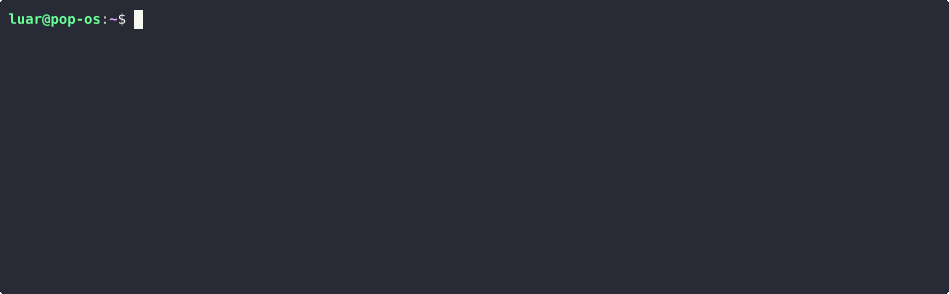

<h3 align="center">When HTTP gets complicated...</h3>
<p align="center">
  
</p>

<p align="center">
  <a href="https://github.com/DeprecatedLuar/better-curl-saul/stargazers">
    
  </a>
  <a href="https://github.com/DeprecatedLuar/better-curl-saul/releases">
    
  </a>
  <a href="https://github.com/DeprecatedLuar/better-curl-saul/blob/main/LICENSE">
    
  </a>
</p>

---


<p align="center">
  
</p>

## **In a nutshell,** this is disgusting:
```bash
curl -X POST "https://company.atlassian.net/rest/api/3/issue" \
  -H "Authorization: Basic $(echo -n 'user@company.com:api-token-here' | base64)" \
  -H "Content-Type: application/json" \
  -H "Accept: application/json" \
  -H "X-Atlassian-Token: no-check" \
  -d '{
    "fields": {
      "project": {"key": "PROJ"},
      "summary": "API Bug: Users can'\''t login after deployment",
      "description": "Steps:\n1. Deploy v2.1.0\n2. Try login\n3. Gets 500 error\n\nExpected: Login works\nActual: Server error",
      "issuetype": {"name": "Bug"},
      "priority": {"name": "High"},
      "assignee": {"accountId": "123456:abcd-efgh-ijkl"},
      "labels": ["api", "login", "production"],
      "customfield_10001": "2024-01-15",
      "customfield_10002": {"value": "Backend Team"}
    }
  }'
```

<h1 align="center">── Try this instead ──</h1 align="center">

<p align="center">
  
</p>

---

## The cool stuff you've never seen before

- **Workspace-based** - Each API gets its own organized folder (reusable)
- **Inline editor** - the `edit` command for any given field also supports `$EDITOR`
- **Smart variables** - `{@token}` persists,`{?name}` prompts every time
- **Response filtering** - Show only the fields you care about
- **Git-friendly** - TOML files version control beautifully
- **Unix composable** - Script it, pipe it, shell it
- **TOML converter** - JSON gets reorganized into TOML for readability
- **Saul Goodman** - Saul Goodman
  


<h1 align="center">─── Installation ───</h1 align="center">

**Supports:** Linux, macOS, Windows (I hope)

### One-Liner
```bash
curl -sSL https://raw.githubusercontent.com/DeprecatedLuar/better-curl-saul/main/install.sh | bash
```

<details>
<summary>Other Install Methods</summary>

<br>

**Manual Install** (boring)
1. Download binary for your OS from [releases](https://github.com/DeprecatedLuar/better-curl-saul/releases)
2. Make executable: `chmod +x saul-*`
3. Move to PATH: `sudo mv saul-* /usr/local/bin/saul`

**From Source** (for try-harders)
```bash
git clone https://github.com/DeprecatedLuar/better-curl-saul.git
cd better-curl-saul
./other/install-local.sh  # Local development build
```

**In case you already have Saul** (hardcore)
```bash
saul set url https://raw.githubusercontent.com/DeprecatedLuar/better-curl-saul/main/install.sh && saul call --raw | bash #(maybe works, who knows)
```
>[!NOTE]
> Quick install auto-detects your system and downloads binaries or builds from source as fallback. 
> Windows users: I don't know powershell I expect, just have bash 👍

</details>


---


## Tutorials

<details>
<summary>Quick Start</summary>

```bash
# Create a test workspace
saul demo set url https://jsonplaceholder.typicode.com/posts/1
saul demo set method GET
saul demo call

# Try with variables
saul api set url https://httpbin.org/post
saul api set method POST
saul api set body name={?your_name} message="Hello from Saul"
saul api call

# Oh... yeah, for nesting just use dot notation like obj.field=idk
```

</details>


<details><summary>Core Commands</summary>
<br>

Alright so you can:

```set```, ```get```, ```edit```, ```rm``` 
 <br>your<br>
```body```, ```header```, ```query```, ```request```, ```history``` or maybe even
```response```
<br>also<br> 
```url```, ```method```, ```timeout```, ```history``` 

</details>

<details><summary>Example</summary>
<br>

```bash
# Configure your API workspace (or preset, same thing)
saul [workspace] set url https://api.example.com
saul set method POST
saul set header Authorization="Bearer {@token}"
saul set body user.name={?username} user.email=john@test.com

# Execute the request
saul call

# Check your configuration, note that preset/workspace name keeps
# stored in memory after first mention on syntax

saul [anoter_workspace] check url
saul check body

# View response history
saul check history
```
</details>

<br>

> [!NOTE]
> There are 2 variable types
> - soft variables {?} prompt you at EVERY call
> - hard variables {@} require manual update by running the flag -v or running 
```saul set variable varname value``` 

---

## 🗺️ Roadmap

- [x] Start watchin Better Call Saul
- [x] Think of a bad joke
- [x] Workspace-based configuration
- [x] Smart variable system (`{@}` / `{?}`)
- [x] In line terminal field editing
- [x] Response filtering
- [x] Response history
- [x] Terminal session memory
- [x] Bulk operations
- [x] Fix history response parsing and filtering
- [ ] Flags, we've got none basically
- [ ] Proper Windows support 
- [ ] GET specific response stuff from history (aka Headers/Body...)
- [ ] Stateless command support with HttPie syntax
- [ ] Homebrew and Scoop releases
- [ ] Support pasting raw JSON template
- [ ] User config system using the super cool github.com/DeprecatedLuar/toml-vars-letsgooo library
- [ ] curl command exportation/generation feature
- [ ] Add the eastereggs
- [ ] Polish code
- [ ] Actual Documentation
- [ ] Touch Grass (not a priority)
- [ ] Think of more features
- [ ] Think of even more features

## Little Note

**Beta software** - Core features work, documentation in progress.

Bug or feedback? I will be very, very, very happy if you let me know your thoughts.


---

<p align="center">
  <a href="https://github.com/DeprecatedLuar/better-curl-saul/issues">
    
  </a>

  ## Leave a comment :D

<script src="https://utteranc.es/client.js"
        repo="DeprecatedLuar/better-curl-saul"
        issue-term="pathname"
        theme="github-dark-orange"
        crossorigin="anonymous"
        async>
</script>

